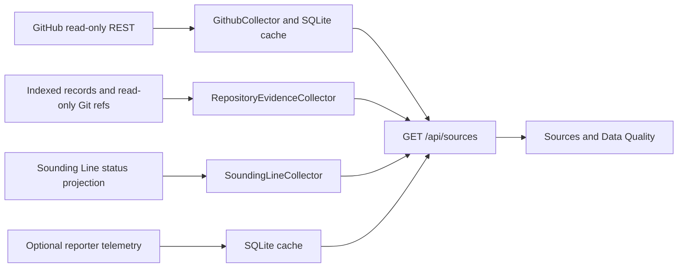

# Project Bridgewatch v2.0 — Phase 1: Open the Instruments

Phase 1 makes the existing Bridgewatch observer's inputs inspectable as a
first-class **Sources & Data Quality** station. It remains an observer: it
cannot create, approve, merge, retry, authorize, or declare release/project
completion. This record does not begin Project Bridgewatch v2.0 Phase 2 or 3.



The runtime repository binding is `BRIDGEWATCH_REPOSITORY`. Project Registry
records are rebound to that configured value at startup; the old retained
`forever-treasure/forever-treasure-companion` literal no longer reaches a
project profile or dashboard. The configured current identity is
`Kgray44/treasurehuntSoT`.

Each source exposes identity, expected/configured/reachable state, authority,
schema, source and Bridgewatch timestamps, received/retained/exposed/displayed
counts, capability classes, coverage, failure classification, repairability,
and retained-stale-data state. Missing ordinary display fields read
`NOT_RECORDED`. Sounding Line is explicitly
`HISTORICAL_EVIDENCE_UNAVAILABLE` when only retained unknown legacy markers are
available; no current plan/node evidence is invented. Reporter telemetry is
`SOURCE_NOT_CONFIGURED` until its distinct token is provided.

The managed loopback service listens before a bounded initial collection. This
separates liveness from source freshness and prevents slow network-backed Git
metadata from becoming a false process-start failure. The default bounded read
timeout is 30 seconds; it is configurable and does not permit write access.

## Deepwater capability-realization impact declaration

```json
{
  "disposition": "CHANGES_EXISTING_CAPABILITY",
  "affectedCapabilityIds": ["FT-035"],
  "affectedFeatureCatalogIds": ["FT-035"],
  "potentialLayerImpact": ["SERVICE", "API", "PROJECTION", "UI", "DISCOVERABILITY"],
  "affectedSurfaces": {"routes": ["#/sources", "#/sources/:name"], "screens": ["Sources & Data Quality"], "journeys": ["Private Bridgewatch source diagnosis"], "apis": ["GET /api/sources", "GET /api/sources/:name"]},
  "expectedTerminalRungEffect": "NONE",
  "evidenceRequiringRefresh": ["bridgewatch unit tests", "loopback browser inspection", "Feature Catalog validation"],
  "rationale": "The observer gains explicit source acquisition and coverage projection; authority, release, and completion behavior remain unchanged."
}
```

No deployment, provider, owner-acceptance, protected-main, or release claim is
made by this design record.
