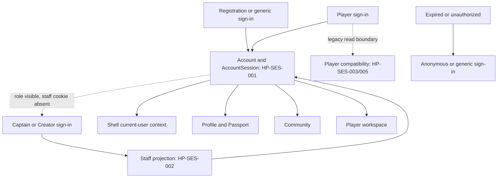
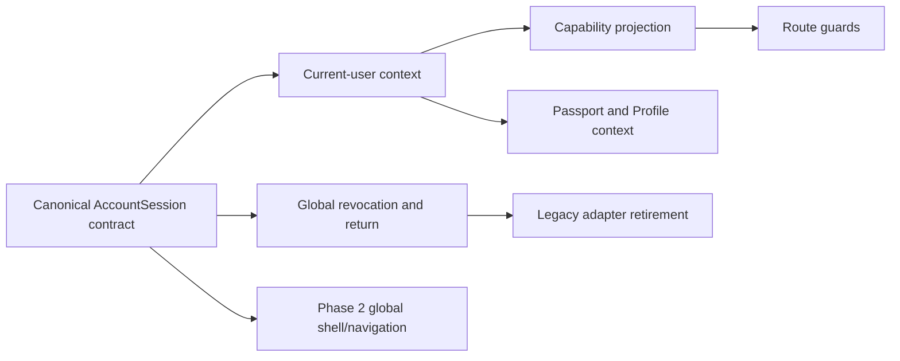

# Project Homeport Phase 0 audit report

> Phase 1 addendum: Phase 0 observations and screenshots remain historical. Current implemented identity/session truth is recorded in the [Phase 1 Implementation Report](Project_Homeport_Phase_1_Implementation_Report.md), [Phase 1 Validation Record](Project_Homeport_Phase_1_Validation_Record.md), and the additive Phase 1 fields in the machine-readable inventories. This link does not rewrite the Phase 0 result.

## 1. Document control and source identity

**FACT:** Project Homeport Phase 0 audited repository `Kgray44/treasurehuntSoT` at fetched `origin/main` and worktree base `8d142227d712d27e363b15903dba9b0c99a04bc8` on branch `codex/project-homeport-product-reality-recovery`. Audit run: `homeport-phase0-20260801T152828Z-8d142227`. Date: 2026-08-01.

## 2. Governing sources read

**FACT:** The supplied 102-page Project Homeport PDF was read completely and visually rendered; SHA-256 `66440D4025AD2A54EE522BFA327BA51B89E2AF161CF17A692748D541C4FC3DAF`. The supplied Voyagewright Global Product Governance Standard was read completely; source SHA-256 `3EF85AAEB0F155725FC2C96CC54C5B0A1EC79A47A2A7B56B56ECF3883C520165`. The task brief and referenced Universal Language and specialist governing/receipt records were read before evidence classification.

## 3. Repository preflight

**FACT:** The canonical checkout contained only the user-supplied untracked governing inputs and was preserved. `origin/main` was fetched/pruned and resolved to the Phase 0 base. An owned linked worktree was created at `C:\Users\kkids\Documents\Codex_TreasureHunt-homeport`; no product branch, database, worktree, or local change was deleted or overwritten.

## 4. Audit environment and isolation

**FACT:** The app ran at `http://127.0.0.1:39117` from 2026-08-01T15:54:52Z through 16:07:07Z using Node 24.18.0 and Codex in-app Chromium 150. Evidence, logs, fixtures, and database were task-owned under `%LOCALAPPDATA%\ForeverTreasureCompanion\homeport-phase0\homeport-phase0-20260801T152828Z-8d142227`. The final audit database SHA-256 is `D294A96D433B8E9CB26B85B376D18E20AEB7368CC6B3D90EC84C12EB98532210`. The server was stopped and port release recorded.

**FACT:** Canonical `prisma/dev.db` remained 3,158,016 bytes, modified 2026-07-31T15:39:37.6984705Z, SHA-256 `DF33983556CF2C6FF01DF6084AE6619EC5DF5C99B11241FA88B4A88F8E144EEB`.

## 5. Fixture family

**FACT:** All 48 SQLite migrations were applied to a copied isolated database. Repository preset `mobile-stress-test` was followed by deterministic fixture `homeport-phase0-synthetic-v1`, checksum `f3580be9bda0e747b1b0b9a4013f00ea4517847f5405eddd32d2efb0894c1135`. It created synthetic linked full-capability and community data only. No real credentials, cookie values, tokens, private Chronicle prose, accepted answers, object keys, exact private locations, or real user data were recorded.

## 6. Route inventory summary

**FACT:** Static census found 236 App Router implementation files: 69 pages and 167 route handlers/services. Every record has source, kind, classification, owner, parent, shell, entry evidence or orphan flag, authentication/capability fields, desktop/mobile path, states, maturity, and disposition. Six specialist ownership buckets are represented: Harborlight 85, One Voyage 85, Wayfarer 47, Sealed Hold 13, platform foundation 5, Lanternwake 1.

## 7. Routes by classification

| Classification                                  | Count |
| ----------------------------------------------- | ----: |
| USER_NAVIGABLE                                  |    38 |
| CONTEXTUAL_DYNAMIC                              |    23 |
| TOKENIZED_DEEP_LINK                             |     3 |
| AUTH_COMPATIBILITY_ALIAS                        |     3 |
| REDIRECT_ALIAS                                  |     2 |
| DEVELOPMENT_ONLY                                |     1 |
| API_OR_SERVICE                                  |   166 |
| INTERNAL_DIAGNOSTIC / STATIC_ASSET / DEPRECATED |     0 |

## 8. Orphaned ordinary routes

**FACT:** Eleven `USER_NAVIGABLE` records lack a literal visible source entry and are explicitly orphaned: `/account/claim`, `/account/merge`, `/account/roles`, `/community/audio`, `/community/maps`, `/community/templates`, `/community/voyage-logs/consent`, `/community/voyage-logs/media`, `/forgot-password`, `/player/invitation`, and `/register`.

**OBSERVATION:** Runtime natural journeys additionally proved that Profile and Community are absent from ordinary gateway/workspace controls even though static source references exist elsewhere. Static reachability evidence and gateway-first reachability are therefore recorded separately.

## 9. Dynamic route-source map

**FACT:** All 23 contextual dynamic routes and 3 tokenized deep links have a non-empty source/parent record. Detail families include profile handles, community slugs, creator/tale/workspace IDs, playthrough/journal content, and studio tale/version/settings routes. Reset, verification, and invitation tokens are recorded as contextual credentials without values.

## 10. Authentication and session summary

**FACT:** Ten authorities were inventoried: 1 canonical, 2 legacy compatibility, 3 guest/invitation, 2 tokenized recovery, and 2 client-hint-only. Each records storage key without value, creator, reader, refresher, revoker/deleter, lifetime, cookie/CSRF relationship, account checks, capability source, client projection, expiry/failure behavior, current reads/writes, disposition, risk, and retirement criteria.

## 11. Current session-authority diagram

## 12. Cookie and client-context summary

**FACT:** Governed names include `wayfarer_account`, `forever_gm`, `chronicle_player`, `chronicle_session`, `forever_player`, `chronicle_pending_invitation`, reset/verification URL tokens, `wayfarer-csrf`, and device/role/presentation hints. No values are stored in artifacts.

**OBSERVATION:** Player authentication can authorize the library before the shell refreshes its account context. Capability projection can hide Player navigation for an identity accepted by the Player route, and visible staff capability can still be denied by the staff cookie guard.

## 13. Visible authentication products

**FACT:** Four visible sign-in products remain: `/sign-in`, `/player/sign-in`, `/captain/sign-in`, `/studio/sign-in`. `/register`, `/forgot-password`, reset, and verification surfaces exist but are not all reachable through the visible generic sign-in lifecycle.

## 14. Sign-in agreement and disagreement matrix

| Surface                               | Current write/result                                 | Agreement                                                                    |
| ------------------------------------- | ---------------------------------------------------- | ---------------------------------------------------------------------------- |
| Generic `/sign-in`                    | canonical account session and authenticated shell    | Mostly agrees; lacks creation/recovery paths                                 |
| Player `/player/sign-in`              | reaches Player library and canonical account session | Disagrees transiently with shell; capability projection can disagree         |
| Captain `/captain/sign-in`            | staff projection plus account bridge                 | Requires separate visible auth after Player account shows Captain capability |
| Studio `/studio/sign-in`              | staff/creator projection                             | Separate product surface remains                                             |
| Non-moderator `/community/moderation` | redirects to generic sign-in                         | Authorization is incorrectly presented as authentication                     |

## 15. Sign-out current behavior

**FACT:** Exercised sign-out visibly returned anonymous state and denied a protected Player route with a preserved return URL. HP-NC-005 is `CLOSED_CURRENT` on this evidence.

**UNRESOLVED:** Phase 0 did not prove atomic invalidation of every compatibility authority or a stale second tab. Global convergence remains Phase 1 acceptance work.

## 16. Shell-mode summary

**FACT:** Six modes are recorded: gateway (1 route), standard (55), authentication (8), compact (3), immersive-player (3), and immersive-captain (declared, no directly classified page record). Gateway and authentication surfaces lack persistent account context; every mode lacks Community access. Account presence, global navigation, workspace switching, mobile/focus/footer behavior, and contradictions are recorded in `Homeport_Navigation_Map.json`.

## 17. Navigation and information-architecture summary

**OBSERVATION:** The gateway is visually rich but exposes role entry and Chronicle discovery, not a unified account or Community. The standard shell has an account control, but Profile and Community are absent, Security bypasses the governed Profile hierarchy, and Player/Captain/Creator switching crosses competing session guards. Six Community districts exist only by direct URL.

**GOVERNING REQUIREMENT:** A capability exists as product only when a person can discover, understand, use, leave, return, and recover through intended controls.

## 18. Desktop/mobile destination parity

**FACT:** Every user-navigable route has desktop and mobile path fields. Seven mobile captures cover gateway, Player sign-in/library, authenticated account menu, Passport, Community root, and sign-out. Mobile Player navigation showed only Explore Chronicles and omitted Profile and Community. Direct URL parity is not counted as ordinary navigation parity.

## 19. Screen maturity summary

**FACT:** The catalog has 76 records: 69 page screens plus 7 explicit state contracts. Maturity: 42 partial, 25 skeletal, 6 unreachable, 1 broken, 1 placeholder, 1 internal-only, and 0 complete.

## 20. Page-state completeness summary

**FACT:** Loading and empty are partial; no-results is partial and visibly exercised; recoverable error is placeholder; dependency-unavailable is unreachable/not reproduced; session-expired is skeletal and exercised; permission-restricted is broken because it flattened to sign-in. No state was inferred passed from HTTP status or source existence.

## 21. Control behavior summary

**FACT:** Thirty critical controls were audited: 16 working, 7 working with weak feedback, 3 unreachable, 2 deceptive, 1 no-visible-feedback, and 1 broken. Every row records visibility/enabled conditions, server authority, pending/success/failure feedback, navigation/focus/keyboard/mobile behavior, reproduction, evidence, and target phase.

## 22. Natural-journey results

**FACT:** Thirteen required journeys were attempted from `/`: 0 passed without qualification, 5 passed with nonconformity, 3 blocked by product defect, 1 blocked by fixture, and 4 unreachable. None were blocked by environment. Direct URL inspection never upgraded ordinary reachability. Full evidence is in `Homeport_Journey_Audit.md` and `Homeport_Journey_Catalog.json`.

## 23. Visual baseline summary

**FACT:** Thirty-two checksum-validated captures cover desktop 1440×900 (20), mobile 390×844 (7), desktop 1280×720 (1), and effective 200% rendering (4). Captures include anonymous/authenticated gateway/account states, Player entry/library, Passport/Profile, Community root/detail/empty/no-results, staff workspaces, Security, expiry, sign-out, and zoom. Raw and committed copies match their manifest checksums. Captures are current truth, not product approval.

## 24. Current nonconformities by severity and owner

**FACT:** All HP-NC-001 through 020 retain traceable dispositions; HP-NC-021 through 028 add eight sequential findings. Total: 28 — 4 critical, 17 high, 7 moderate, 0 low. Dispositions: 17 open roots, 8 dependent, 2 monitor, 1 closed current. Every item includes owner, integration owner, target phase, reproduction, expected/observed result, evidence, impact, dependencies, and acceptance contract.

**FACT:** Critical items are identity/context disagreement (004), flattened authorization/expiry behavior (017), staff capability versus cookie denial (023), and permission denial redirected to sign-in (027). Owner details remain machine-readable in the ledger.

## 25. Security and privacy observations

**FACT:** Permission denial is currently indistinguishable from authentication failure on the exercised moderation route. Multiple session authorities increase revocation and stale-context risk. Passport exposes testing/provider implementation controls to an authenticated user. Synthetic evidence contains no secrets or real private data; canonical database state was not mutated.

## 26. Compatibility and legacy observations

**FACT:** Three auth compatibility aliases, two redirect aliases, legacy Player/staff readers, invitation state, and role/device hints remain. Their existence is not itself failure; unbounded or contradictory visibility is. Phase 1 must instrument adapters and meet retirement criteria before removal.

## 27. Phase 1 dependency map

## 28. Shared contracts that must be frozen before implementation

**GOVERNING REQUIREMENT:** Phase 1 must freeze canonical current-user payload, sign-in/registration intended return, capability source, expiry versus permission semantics, sign-out/revocation breadth, multi-tab invalidation, Passport context, compatibility adapter telemetry, and acceptance tests before changing shared behavior. The Phase 0 vocabularies and evidence IDs are frozen in the design record.

## 29. Risks

- **CRITICAL:** Route authorization, shell projection, and visible capabilities can disagree for one account.
- **HIGH:** Converging cookies without bounded adapters could strand bookmarks or legacy sessions.
- **HIGH:** Shared shell/auth files are active cross-project conflict surfaces.
- **HIGH:** Schema-first work could create migration risk before proving a storage gap.
- **MODERATE:** Static source reachability can overstate gateway-first reachability.
- **MODERATE:** Full-page animation/fixed-element captures can visually duplicate content; checksums and reviewer classification preserve that limitation.

## 30. Exact Phase 0 exit-gate evaluation

| Gate                      | Evaluation                                                                                                                                                                      |
| ------------------------- | ------------------------------------------------------------------------------------------------------------------------------------------------------------------------------- |
| Repository and governance | PASS — current origin/main recorded; dedicated branch/worktree; canonical global/Homeport Markdown plus PDF; agent pointers and indexes; no duplicate authority intended        |
| Route truth               | PASS — all 236 implementations classified exactly once; entries/orphans, dynamic sources, compatibility, desktop/mobile paths, and schema validation present                    |
| Session truth             | PASS — all 10 authorities and 4 visible sign-in products mapped; keys without values; lifecycle/projections/disagreements/sign-out/expiry documented; schema validation present |
| Screen and control truth  | PASS — 76 screen/state contracts, 32 desktop/mobile/zoom captures, 30 controls, honest state/maturity classification, privacy-safe evidence                                     |
| Journey truth             | PASS — all 13 attempted from gateway; every result classified; direct URL excluded from ordinary reachability; desktop/mobile evidence recorded                                 |
| Nonconformity truth       | PASS — 001–020 preserved, 021–028 sequential, root/dependent relations, evidence/owners/contracts present, one evidence-based closure only                                      |
| Phase boundary            | PASS — no Phase 1 product or schema behavior change; complete contract/dependency inputs; readiness decision recorded                                                           |

**FACT:** Artifact validator result: `ARTIFACT_SCHEMA_VALID` and `PRODUCT_NONCONFORMITIES_PRESENT`. The latter is the intended product-reality marker.

**RECOMMENDATION:** Phase 1 is ready to begin under its own governed scope. This is readiness to implement against complete evidence, not a statement that the product is accepted or that any nonconformity is resolved.

## 31. Phase boundary statement

**FACT:** No Phase 1 product implementation was performed. This phase changed no authentication, navigation, shell, Profile, Passport, Community, database schema, or user-visible product behavior. It added governance, forensic inventories, isolated synthetic audit evidence, validators/tests, Sounding Line registration, and current-truth records only.
