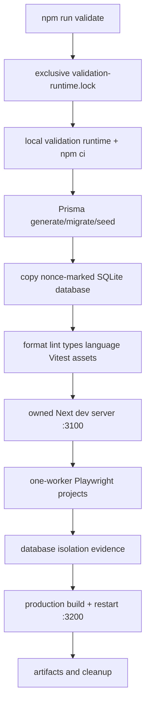

# Current Testing System Audit

**Audited baseline:** `origin/main` `676b21ed030a5470d4ea0a36c0688ed3ecb161e5`, 2026-07-28. This is current repository structure, not a claim that historical reports remain current evidence.

## Current tools and execution flow

| Area                  | Current truth                                                                                                                                  | Primary source                                                                       |
| --------------------- | ---------------------------------------------------------------------------------------------------------------------------------------------- | ------------------------------------------------------------------------------------ |
| Unit/component        | Vitest 4.1.10, jsdom, `maxWorkers: 4`; 101 configured files including `src/**/*.test.*` and `tests/private-content/**/*.test.*`                | `vitest.config.ts`                                                                   |
| Browser/accessibility | Playwright 1.56.1, Axe, Chromium/Desktop Chrome and WebKit/iPhone 14 projects; one worker and `fullyParallel: false`; 23 `tests/e2e/*.spec.ts` | `playwright.config.ts`, `tests/e2e/`                                                 |
| Static                | Prettier 3.6.2, ESLint 9, TypeScript                                                                                                           | `package.json`, `scripts/test-all.ps1`                                               |
| Database              | Prisma 6.19.3; SQLite local schema and MySQL parity schema; 25 SQLite and 24 MySQL migration scripts                                           | `prisma/schema*.prisma`, `prisma/*migrations/`                                       |
| Build/restart         | Next production build and owned process health/restart proof                                                                                   | `scripts/test-all.ps1`                                                               |
| Privacy/security      | private-content scanner/build/staged-diff/fixture commands; authorization and package tests                                                    | `scripts/private-content/`, `tests/private-content/`                                 |
| Language/architecture | user-facing language and One Voyage architecture validators                                                                                    | `scripts/validate-user-facing-language.ts`, `scripts/validate-project-one-voyage.ts` |
| CI                    | no `.github/workflows` directory is present at this baseline                                                                                   | repository audit                                                                     |

`npm test`, `npm run test:e2e`, `npm run lint`, `npm run typecheck`, `npm run format:check`, and `npm run build` are focused commands. `npm run validate` executes `scripts/test-all.ps1`: it acquires a global validation lock; mirrors to a local runtime; installs exact dependencies; generates/migrates/seeds SQLite; clones a nonce-marked mutation database; runs static/unit/asset/language/database checks; starts an owned Next server; runs browser acceptance; verifies database state; builds; and proves restart/performance behavior where selected.

The harness fingerprints `dev.db`, `-wal`, `-shm`, and `-journal` before and after; `scripts/prepare-validation-isolation.ts` also verifies nonce/server process ancestry and expected mutation in the disposable copy. Browser reports/traces are written beneath the validation runtime. `docs/testing.md` and `Development_Docs/Isolated_Validation_Baselines.md` document the baseline and focused browser modes.

## Bottlenecks and remedies

| Current behavior and source                                                   | Consequence/risk                                                              | Sounding Line remedy                                                                     |
| ----------------------------------------------------------------------------- | ----------------------------------------------------------------------------- | ---------------------------------------------------------------------------------------- |
| One OS lock wraps the entire full run: `scripts/test-all.ps1`                 | Static or pure tests wait behind browser/build work; safe but poor throughput | resource-specific leases; retain exclusivity only for shared runtime/baseline boundary   |
| Fixed owned ports 3100 and 3200 are enforced in harness/config                | unrelated browser/restart runs cannot coexist                                 | brokered port ranges with verified owner identity                                        |
| Playwright uses one worker and `fullyParallel: false`                         | serial long-tail browser matrix                                               | shard only after per-run database/storage/project isolation is explicit                  |
| validation runtime is mirrored and dependencies installed/generated for a run | repeated setup, install, Prisma generation, and browser installation          | immutable dependency cache/runtime image lease with per-run writable overlay             |
| browser project setup is shared (`phase3-readonly-setup`)                     | one setup defect can obscure dependent failures                               | dependency-node receipt and root/cascade classification                                  |
| dedicated worktrees need a supplied baseline path                             | fresh worktree setup can block acceptance                                     | versioned immutable baseline registry and clone service                                  |
| SQLite is safely copied but only one global harness owns it                   | no unrelated SQLite browser lanes                                             | per-run clone plus per-port/root lease; preserve checksum proof                          |
| MySQL rehearsal is a separate ordered PowerShell flow                         | external/configuration state cannot be compared with local outcomes           | external-provider gate with schema lease, account separation, and explicit blocked state |
| long browser specs have serial blocks/skips/timeouts                          | slow tail and unclear policy history                                          | suite metadata, visible skip reason, duration history, governed flake review             |
| no repository CI workflows                                                    | no distributed or reproducible CI gate currently defined                      | phase-four CI adapters; do not claim CI implementation now                               |

## Strengths to preserve

- Canonical SQLite family fingerprinting, nonce identity, mutation proof, and safe in-runtime cleanup.
- Refusal to reuse/kill an occupied validation port and process-tree ownership checks.
- Separate read-only setup and mutation project routing, browser traces/screenshots/video on failure, and Axe use.
- Local runtime concept for UNC reliability; explicit baseline path for dedicated worktrees.
- Full build/restart proof, migration/backfill checks, language/architecture/private-content validators, and durable validation artifacts.
- Existing `.gitignore` exclusions for databases, private roots, artifacts, tokens, and runtime data.

## Test-family inventory

| Family                    | Current evidence / command                                             | Resources and current lane                         | Future lane                   |
| ------------------------- | ---------------------------------------------------------------------- | -------------------------------------------------- | ----------------------------- |
| Static                    | `format:check`, `lint`, `typecheck`, language/architecture validators  | Node/filesystem; normally safe to parallelize      | static                        |
| Unit/component            | 101 configured Vitest files; `npm test`                                | jsdom/Node; normal max 4 workers                   | unit, component               |
| Private/security          | 11 private-content Vitest files and scanners                           | synthetic private fixtures/scanner configuration   | security/privacy              |
| API/service               | route/server tests in `src/app/api`, `src/server`, `src/platform`      | mocked or SQLite-aware process state               | API/service                   |
| Database/migration        | SQLite deploy/seed/backfill and MySQL rehearsal                        | SQLite clone or external MySQL                     | database, migration, external |
| Browser/accessibility     | 23 Playwright specs, Axe, Chromium/WebKit projects                     | fixed port + owned server + shared copied DB today | browser, accessibility        |
| Compatibility/contracts   | One Voyage, Wayfarer, Lanternwake, Harborlight and legacy specs        | project fixtures; some serial mutation behavior    | contracts, compatibility      |
| Build/restart/performance | Next build, restart and phase-3 performance config                     | production output and port 3200                    | build, restart                |
| Backup/restore/provider   | CLI supports backup/restore verification and MySQL/provider rehearsals | configured external services                       | external-provider             |

Approximate duration is not reliably stored per suite in this baseline; the future store must capture queue, setup, execution, teardown, retry, and total duration before budgets become enforcement. Ownership is inferred from path/project and is formalized as a baseline—not complete migration—in `testing/ownership.json`.

## Lock and shared-resource analysis

| Resource                                                          | Current acquisition/scope                                                | Safety value                                                                      | Replacement boundary                                                                 |
| ----------------------------------------------------------------- | ------------------------------------------------------------------------ | --------------------------------------------------------------------------------- | ------------------------------------------------------------------------------------ |
| `%LOCALAPPDATA%\ForeverTreasureCompanion\validation-runtime.lock` | exclusive `FileShare::None`, held by `test-all.ps1` for whole validation | prevents mirror/runtime/canonical boundary collision; no owner metadata/heartbeat | validation-runtime lease only, with run/process identity and stale-owner diagnostics |
| validation runtime under `%LOCALAPPDATA%`                         | reset/cleanup only after child-path checks                               | protects worktree/canonical paths                                                 | unique run root, artifact lease, marker-gated cleanup                                |
| port 3100                                                         | harness checks availability and owns Next dev server                     | prevents process collision                                                        | application-port lease                                                               |
| port 3200                                                         | harness checks ownership for production restart/performance              | prevents restart collision                                                        | restart-host/production-port lease                                                   |
| SQLite baseline                                                   | repeated family hash and isolated copied DB                              | canonical-data protection                                                         | immutable baseline + per-run clone lease                                             |
| generated Prisma client                                           | generated inside runtime, SQLite generated last by current workflow      | avoids cross-schema client contamination                                          | provider/schema-specific generated-client cache lease                                |

No lock should be removed until its protected mutable resource has a narrower replacement. There is no stale-lock recovery beyond OS-handle release, no lease heartbeat, and no normalized run receipt today.
