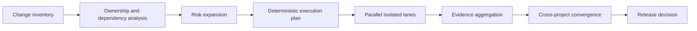
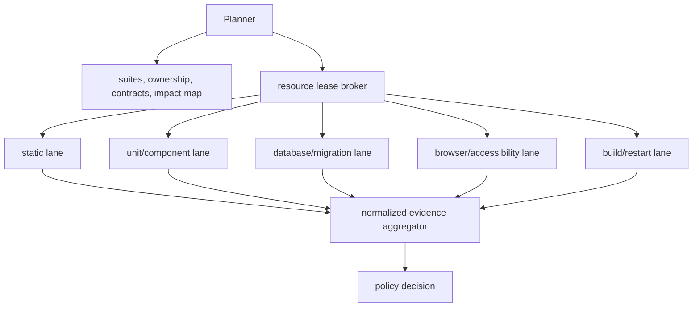

# Testing Architecture

## Current to target

Today, the repository's strongest path is a safe serialized validation harness. It owns one local runtime, copies a SQLite mutation database, drives a fixed-port server, and executes static through restart checks in sequence. The target retains those boundaries but turns them into independently schedulable plan nodes with resource leases and evidence receipts.

## Execution contract

The planner outputs ordered nodes with stable suite IDs, selection/omission explanations, dependencies, contracts, changed paths, risk, requested gate, resources, cleanup action, and retry rule. The orchestrator may execute ready nodes in parallel. It waits on true dependencies, not arbitrary family order, and reports a prerequisite failure as one root result plus blocked dependents.

| Lane                  | Present command/source                                    | Target isolation                                                     |
| --------------------- | --------------------------------------------------------- | -------------------------------------------------------------------- |
| static                | Prettier, ESLint, `tsc`, language/architecture validators | read-only checkout snapshot, Node slot                               |
| unit/component        | Vitest                                                    | worker pool and isolated temporary output                            |
| contracts/API         | route/server/project tests                                | contract fixture and API/database lease                              |
| database/migration    | Prisma SQLite/MySQL rehearsal                             | cloned SQLite or named MySQL schema/account                          |
| browser/accessibility | Playwright/Axe                                            | unique port, DB clone, storage/media root, browser shard, trace root |
| security/privacy      | private-content scanners/tests                            | synthetic fixtures, redacted output, scanner lease                   |
| build/restart         | Next build and owned restart proof                        | build directory, restart host/port, process lease                    |
| external provider     | MySQL, scanner, KMS/object storage where configured       | explicit provider namespace/account and external classification      |

## Local, CI, release, and cleanup

Local work starts with changed-file planning, then focused tiers from reproducer through browser/contract scope; it does not repeatedly run the full repository gate. CI consumes the same plan and policy with clean worker identities. Release uses the plan's release expansion and executes every applicable mandatory gate, including external evidence or an explicit blocked decision.

Cleanup is a first-class node. It records artifact paths, stops only process-tree-owned children, releases only matching leases, verifies cloned-data removal, and never removes another run's lock or artifacts. Cancellation stops unscheduled dependents and classifies them `cascade-blocked`; it does not mark them passed.

## Migration path and acceptance

Phase 1 wraps current commands as metadata-backed adapter suites and writes receipts without changing their semantic checks. Phase 2 introduces isolated resource families beside the legacy harness. Phase 3 enables conservative change planning and failure graphing. Phase 4 adds distributed adapters and deterministic release parity. Adoption cannot replace the present harness until current canonical database, ownership, restart, and artifact protections are demonstrably preserved.
