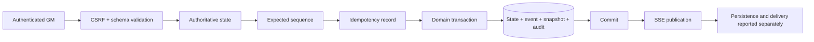

# Administrative command pipeline

## Phase 3 Quartermaster bridge hardening

The Quartermaster command, compatibility action, and status routes require the server-side `CAPTAIN` capability in addition to the GM session and CSRF boundary. Both Quartermaster pages apply the same capability gate. Request validation uses a bounded discriminated payload; unexpected failures return a generic response while correlation-safe detail remains server-side.

Idempotency compares a canonical fingerprint of the complete command intent, including campaign, command, expected sequence, target, and normalized payload. A repeated key may replay only the same intent. Every sequence-consuming business path reserves `expectedSequence` with a conditional update inside the same transaction as the state/event/audit work, including progression, custom event, and staged-command execution, so two different keys cannot both win one expected sequence.

`PREPARE_HINT` preserves staged-command truth: a committed preparation records its prepared action identity, reports process publication as not applicable/not attempted, and can be recovered as the committed staged result. Receipts continue to distinguish committed persistence, process publication, Player delivery, presentation, and acknowledgment; none of the later states is inferred from a successful database transaction.

The client supplies intent, not current state. `expectedSequence` protects stale tabs; `(campaignId,idempotencyKey)` is unique; domain uniqueness protects repeat awards and releases. Completed duplicates replay their stored result. Failures retain correlation and sanitized code.

Preview follows validation → projected clone → player visibility → consequence summary. It creates no idempotency record, sequence, audit/event row, or SSE publication.
