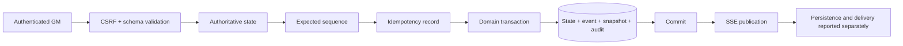

# Administrative command pipeline

The client supplies intent, not current state. `expectedSequence` protects stale tabs; `(campaignId,idempotencyKey)` is unique; domain uniqueness protects repeat awards and releases. Completed duplicates replay their stored result. Failures retain correlation and sanitized code.

Preview follows validation → projected clone → player visibility → consequence summary. It creates no idempotency record, sequence, audit/event row, or SSE publication.
