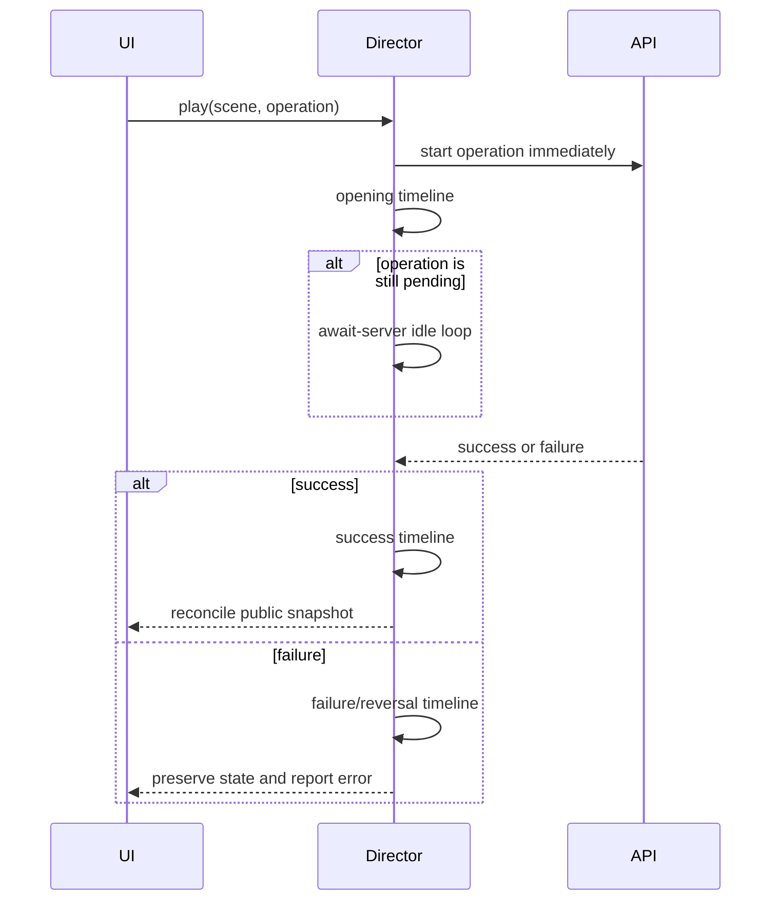

# Animation architecture

The cinematic layer is an orchestration system, not a set of component timers. `AnimationProvider` owns one `AnimationDirector`; every meaningful scene is registered by name and built as a GSAP timeline inside a scoped `gsap.context`. Motion handles component presence and direct interaction, StPageFlip handles the journal's physical page surface, Rive owns stateful vector objects, and Lottie owns ambient or illustrative loops.

## Server-synchronized sequence

For an authenticated mutation, the director starts the real request immediately and plays only the non-authoritative opening while the request is pending. A slow request enters a bounded idle loop. Success content cannot start until the server accepts the mutation. A rejection runs the scene's failure branch and leaves the existing public snapshot in place.

The player consumes one SSE connection. Events are sorted through one promise queue, mapped to a registered scene, presented, acknowledged, and then reconciled from a fresh server-filtered snapshot. Navigation, page turns, and decorative loops do not create additional event streams.

## Lifecycle and control contract

The director exposes play, queue, pause, resume, seek by progress or label, speed from 0.25x to 2x, skip, supported reverse, cancel, and kill. It cancels outstanding waits, kills current timelines, reverses cleanup registration order, reverts SplitText/GSAP contexts, and releases property ownership on completion or unmount. Document visibility pauses an active timeline; a user-paused timeline does not resume merely because the tab becomes visible.

Every scene reports a live snapshot: scene, phase, label, progress, speed, mode, queue depth, pause state, and error. The development showcase and compact runtime controls consume this same state instead of maintaining a second playback model.

## Motion modes

`full`, `gentle`, and `reduced` are product modes. The browser's `prefers-reduced-motion` always resolves to `reduced`, even when the saved product preference says otherwise.

- Full preserves authored distance, duration, ambience, particles, page curl, and camera-like framing.
- Gentle uses 58% duration, 42% distance, fewer decorative effects, and shorter page turns while preserving narrative order.
- Reduced uses immediate state changes, no spatial travel or ambient loops, a representative Lottie frame, stable Rive poses, and an accessible paged journal in place of page curl.

Modes do not change server state, content order, or acknowledgement rules. Skip also preserves those invariants: it renders the final visual state and then reconciles truth.

## Adding a journal page type

Add the discriminated `kind` and safe fields to `JournalPage` in `src/animation/journal/page-model.ts`, generate a stable ID from public snapshot keys rather than array position, render that kind once in `JournalWorkspace`, and include it in the semantic/reduced page path. Never pass raw database records into the model. Extend the page-model tests for locked-content filtering, stable indices after a snapshot refresh, even spread padding, and chapter navigation; StPageFlip should receive the resulting React HTML through `updateFromHtml`, not a replacement instance.

## Failure boundaries

Rive, Lottie, and StPageFlip are dynamically imported. Each has a local SVG or React fallback. Failed visual assets are recorded for the development metrics panel but do not block authentication, progression, reading, navigation, or GM commands. No animation failure is allowed to roll back a committed server transaction.
