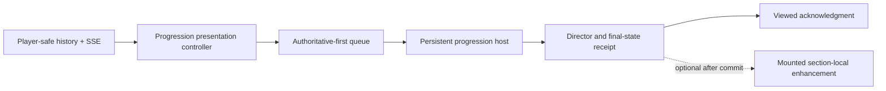
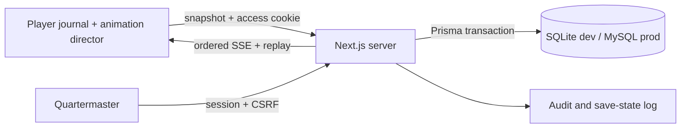

# Architecture

## Wayfarer profile boundary

`UserAccount` is the private person root and `PlayerProfile` is its canonical
person-facing projection. Public profile data is shaped by the Wayfarer server
projection service; Harborlight Community records retain Community-specific
status and releases but must not become a second writer for visible identity.
Chronicle runtime facts stay with One Voyage, private package/assets stay with
Sealed Hold, and animation policy stays with Lanternwake.

## Lanternwake Phase 3 presentation boundary

Phase 3 adds one persistent `ProgressionSceneHost` to the compatibility companion at `/tale/[campaignSlug]`. It remains mounted while the six sections (`journal`, `chart`, `treasures`, `quests`, `log`, and `finale`) change and is the sole global presentation authority for the exact 17 Player progression-event types. The host owns readable ceremony, notification controls, focus capture/restoration, fallback, and receipt production; it does not own business state, section navigation, or event persistence. This is not a claim that the compatibility host exists on the canonical durable journal route at `/player/playthroughs/[playthroughId]/journal`.

The controller keeps separate observed, queued, presented, and acknowledged cursors. A snapshot sequence remains business-state position and is never substituted for a presentation cursor. Live and reconnect events outrank replay, replay uses a fresh identity and cannot acknowledge or mutate, and only a receipt with Director acknowledgment proof may produce the idempotent per-device viewed record. Authorized replay history is bounded and reconstructed as a Player-safe projection; a chapter release whose current authorized chapter cannot be reconstructed is omitted instead of leaking stored prose.

Reconnect first revalidates access, then merges bounded history with the one SSE stream by durable sequence and event ID. The stream closes the query-to-subscribe race, bounds its live buffer/dedupe window, periodically revalidates access, and emits a terminal access-revoked signal. The Player surface clears protected workspace/history on revocation and renders a readable access state.

The Quartermaster bridge requires the `CAPTAIN` capability in addition to its session and CSRF boundary. Commands validate a bounded discriminated payload, reserve the expected campaign sequence with a compare-and-set inside the business transaction, and compare a canonical idempotency fingerprint. Persistence, process publication, delivery, presentation, and acknowledgment remain distinct receipt states; a prepared hint cannot be reported as published merely because staging committed.

## Phase 3 cinematic companion projection

The player reads one server-filtered `PublicSnapshot` containing chapters, released hints/annotations, visible map locations/routes, safe artifact states, visible optional mysteries, event-derived log entries, generic finale state, and per-section unseen counts. One SSE connection transports ordered sanitized events; section navigation is client-side and starts no independent polling.

New normalized records are `MapRoute` and `ViewedContent`. Existing content models gained release, relationship, placement, and safe-label fields rather than duplicating derived display tables. `AudioPreference` now carries the cross-device preference projection; immediate UI choices may also be cached locally for offline startup.

Server Components enforce initial access. Route handlers own authentication, validation, snapshots, and SSE. `src/server/progression.ts` is the transaction boundary; `src/domain/story.ts` owns state rules. The UI receives only a public projection, never database rows. In-memory publish accelerates same-process delivery while database replay by sequence remains authoritative after reconnect/restart.

The client adds one animation director between ordered domain events and presentation. It starts server work immediately, allows only non-authoritative opening/idle motion while pending, and selects a success or failure timeline from the actual response. One queue owns SSE ceremonies, and the public snapshot remains authoritative after skip, cancellation, reconnect, or visual-runtime failure.

Major dependencies remain deliberately bounded: Prisma for persistence and transactions, bcryptjs for portable hashes, Zod for payload validation, GSAP for cinematic orchestration, Motion for React interaction/presence, StPageFlip for the journal surface, Rive/Lottie for isolated vector assets, Pino for structured redacted logs, and Vitest/Playwright for validation. See `docs/animation/architecture.md` and `docs/animation/library-ownership.md`.

Phase 3 adds an administrative intent layer. `/api/gm/preview` projects without writes, `/api/gm/staging` persists unreleased intent, and `/api/gm/commands` enforces expected sequence and idempotency. `PlayerPresence` supplies expiring evidence. See [admin command pipeline](admin-command-pipeline.md) and [player presence](player-presence-and-sync.md).

## Chronicle Studio Phase 1

Studio is additive to the original campaign companion. `Chronicle` owns identity and catalog metadata; `TaleDraft` owns optimistic autosave state; chapters, blocks, and connections form the editable graph. Publishing validates that graph and writes a complete, checksummed `PublishedTaleVersion.contentSnapshot`. Published rows and referenced asset variants are immutable from the player runtime's perspective.

`src/chronicle/progression.ts` is the authoritative session engine. Each non-preview `TaleSession` is pinned to one published version and advances through idempotent, ordered events. The player receives its current projection and SSE updates; Captain actions call the same engine. Verification providers all enter through one versioned submission contract, so the simulator and a future paired helper cannot bypass progression rules. See `docs/chronicle-studio.md`.

## Unified Chronicle Platform

The platform extends the Studio/session model rather than copying it. `PlayerProfile`/`PlayerIdentitySession` add durable Player identity; `PlaythroughMembership` is the per-Player authorization and library record; `Invitation`/`InvitationEvent` own single-recipient credential lifecycle; `RevealState` is the historical disclosure ledger; `PlatformRoleAssignment` supplements staff capability scope; and `PlatformAuditEvent` records correlated resource actions. `TaleSession` remains the one playthrough aggregate and retains the exact immutable version relation.

`src/platform/auth.ts`, `policy.ts`, `state.ts`, `invitations.ts`, `libraries.ts`, and `audit.ts` separate authentication, policy, lifecycle, transactional invitation behavior, workspace-specific projections, and safe auditing. Player, Captain, and Creator route families call those services and never serialize a raw aggregate. Compatibility routes call the same progression engine. See [Chronicle Platform](chronicle-platform.md) for lifecycle, migration, and security detail.

## Canonical Player journal

The Player Library is the place where Chronicles are browsed. The immersive journal is the place where Chronicles are played. `/player/playthroughs/[id]/journal` is therefore the canonical active, resumed, paused, and completed Player route; compatibility play and archive routes converge on the same component.

`src/chronicle/progression.ts` remains authoritative. It projects a recursive Player-safe `journal` view from the pinned published snapshot, reveal ledger, ordered events, and current session pointers. `src/chronicle/journal-contract.ts` defines the ten presentation modes and secret boundary, while `src/chronicle/journal-page-model.ts` converts only released content into stable physical pages. `PhysicalJournalBook` owns the shared book shell and `ChronicleJournalSession` owns SSE reconciliation, reading position, presentation state, and Player actions. Reading state is persisted separately from progression through the existing Player preferences record.

This separation keeps Creator content canonical, the Captain engine authoritative, and historical reading immutable. A future location/vision provider can submit a scoped verification outcome through the existing envelope; the resulting ordered event and canonical state projection drive the same journal without a provider-specific Player runtime.
