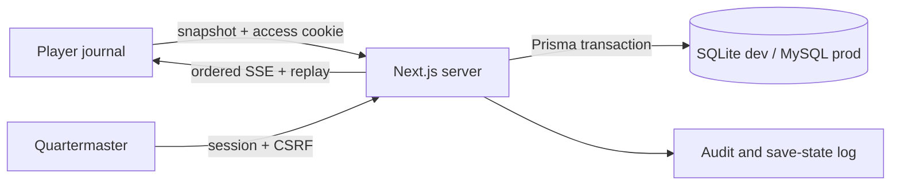

# Architecture

Server Components enforce initial access. Route handlers own authentication, validation, snapshots, and SSE. `src/server/progression.ts` is the transaction boundary; `src/domain/story.ts` owns state rules. The UI receives only a public projection, never database rows. In-memory publish accelerates same-process delivery while database replay by sequence remains authoritative after reconnect/restart.

Major dependencies are deliberately limited: Prisma for normalized persistence and transactions, bcryptjs for portable hashes, Zod for payload validation, Framer Motion for accessible choreography, Pino for structured redacted logs, Vitest/Playwright for validation.
