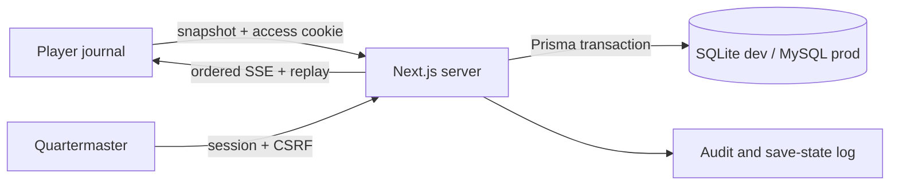

# Architecture

## Phase 2 companion projection

The player reads one server-filtered `PublicSnapshot` containing chapters, released hints/annotations, visible map locations/routes, safe artifact states, visible optional mysteries, event-derived log entries, generic finale state, and per-section unseen counts. One SSE connection transports ordered sanitized events; section navigation is client-side and starts no independent polling.

New normalized records are `MapRoute` and `ViewedContent`. Existing content models gained release, relationship, placement, and safe-label fields rather than duplicating derived display tables. `AudioPreference` now carries the cross-device preference projection; immediate UI choices may also be cached locally for offline startup.

Server Components enforce initial access. Route handlers own authentication, validation, snapshots, and SSE. `src/server/progression.ts` is the transaction boundary; `src/domain/story.ts` owns state rules. The UI receives only a public projection, never database rows. In-memory publish accelerates same-process delivery while database replay by sequence remains authoritative after reconnect/restart.

Major dependencies are deliberately limited: Prisma for normalized persistence and transactions, bcryptjs for portable hashes, Zod for payload validation, Framer Motion for accessible choreography, Pino for structured redacted logs, Vitest/Playwright for validation.
