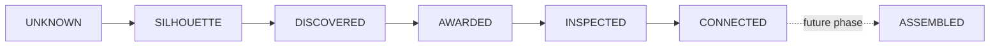

# Artifact system

Artifacts progress through `UNKNOWN`, `SILHOUETTE`, `DISCOVERED`, `AWARDED`, `INSPECTED`, `CONNECTED`, and the future-only `ASSEMBLED` state. Unknown records expose only neutral placement structure. Silhouettes expose only an approved safe name/label. Full names, descriptions, discovery text, related chapter, and award time require a released state.

Assembly groups and neutral positions exist for layout testing, but the seed deliberately does not resemble or name a real finale object.
