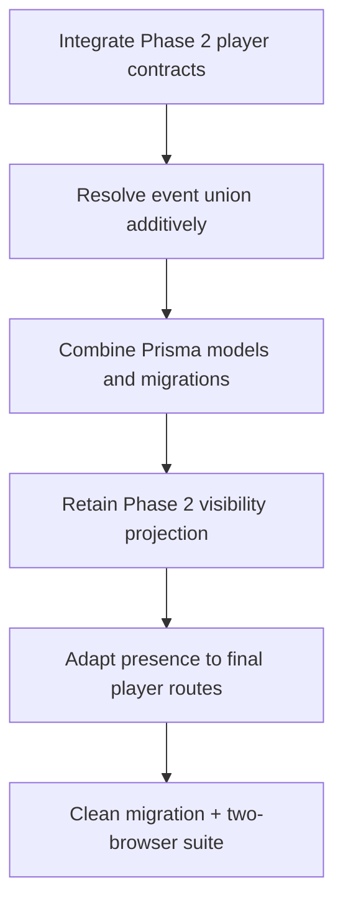

# Phase 2 and Phase 3 integration plan

This branch began on pre-Phase-2 `main` at `70bb654` and now includes Phase 2 `main` through `ede3764` via a normal merge commit. Phase 2 remains authoritative for player rendering/visibility; Phase 3 remains authoritative for administrative intent, presence, execution, staging, and audit correlation.

Migration order: Phase 1 init, Phase 2 additive migration, then Phase 3 command-center migration. Reconciliation tests cover older snapshots, hidden content, hint/artifact/map/quest delivery, route presence, acknowledgement, SSE reconnect, preview nonmutation, stale commands, and reversal.
