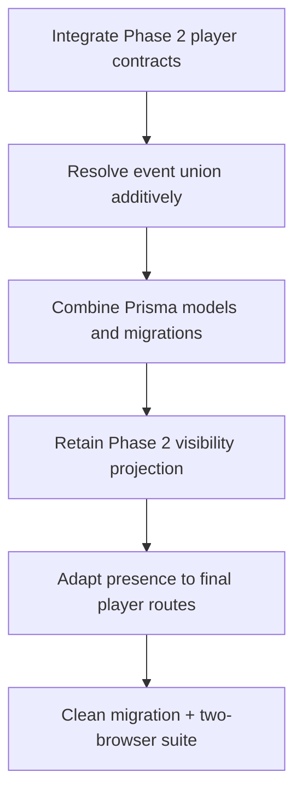

# Phase 2 and Phase 3 integration plan

This branch is based on pre-Phase-2 `main` at `70bb654`. Phase 2 owns final player rendering/visibility; Phase 3 owns administrative intent, presence, execution, staging, and audit correlation. Do not choose one side wholesale.

Migration order: Phase 1 init, Phase 2 additive migration, then Phase 3 command-center migration. Reconciliation tests cover older snapshots, hidden content, hint/artifact/map/quest delivery, route presence, acknowledgement, SSE reconnect, preview nonmutation, stale commands, and reversal.
