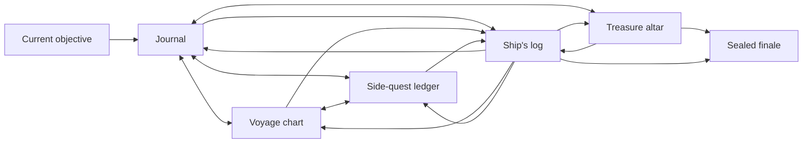

# Player Companion information architecture

The companion has six URL-addressable sections: `journal`, `chart`, `treasures`, `quests`, `log`, and `finale`. The selected section is stored in the `section` query parameter so refresh, deep links, back/forward navigation, and mobile/desktop handoff share one model. A persistent objective links back to the active journal chapter.

All sections are projections of one authenticated public snapshot and one ordered SSE stream. Navigation never fetches hidden content and never starts a second polling loop.

Desktop uses an artifact-like section rail and layered workspace. iPhone uses the same semantic navigation as a safe-area-aware bottom strip and one-column content. Locked links may navigate only to a safe locked state; they never cause protected payloads to be requested.

## Persistent presentation layer

On the compatibility `/tale/[campaignSlug]` surface, one `ProgressionSceneHost` sits outside the conditional six-section workspace. It may temporarily present a modal ceremony layer while leaving the selected section mounted but inert and hidden from assistive technology. The host focuses the first enabled Skip, Replay, or destination control, otherwise its heading, and restores the exact eligible prior focus or the section heading/destination fallback when the overlay settles.

Event presentation does not change the `section` query parameter. The readable global outcome is available from every starting section; an optional local enhancement runs only when its relevant section is already mounted. Replay and explicit destination controls are user actions, not automatic navigation.

If the server revokes access, the live stream terminates, the presentation controller and authorized replay history are cleared, the protected workspace is removed, and the route exposes a readable access-revoked state. This compatibility presentation host is not present by implication on the canonical `/player/playthroughs/[playthroughId]/journal` route.
