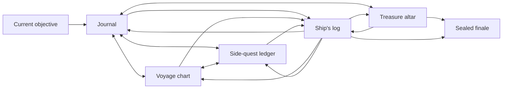

# Player Companion information architecture

The companion has six URL-addressable sections: `journal`, `chart`, `treasures`, `quests`, `log`, and `finale`. The selected section is stored in the `section` query parameter so refresh, deep links, back/forward navigation, and mobile/desktop handoff share one model. A persistent objective links back to the active journal chapter.

All sections are projections of one authenticated public snapshot and one ordered SSE stream. Navigation never fetches hidden content and never starts a second polling loop.

Desktop uses an artifact-like section rail and layered workspace. iPhone uses the same semantic navigation as a safe-area-aware bottom strip and one-column content. Locked links may navigate only to a safe locked state; they never cause protected payloads to be requested.
