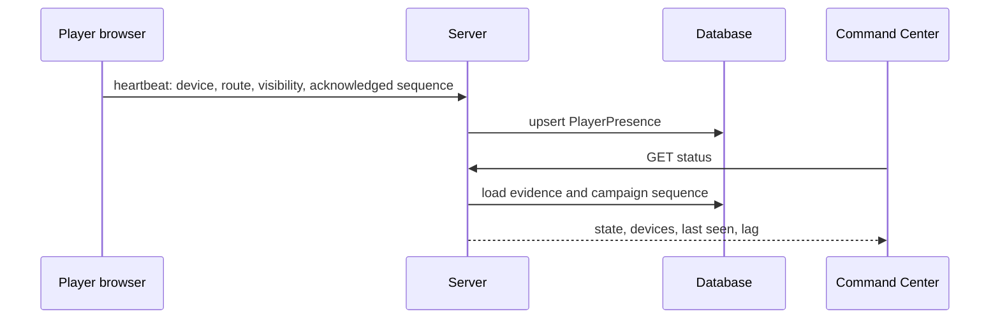

# Player presence and synchronization

Connected means a non-disconnected heartbeat within 45 seconds. Recently lost means evidence within 120 seconds. Older evidence is stale; no evidence is unknown. A connected transport is never labeled “viewed.” Synchronized requires an active device whose acknowledged sequence equals the campaign sequence. Future production maintenance should expire records older than 30 days.
