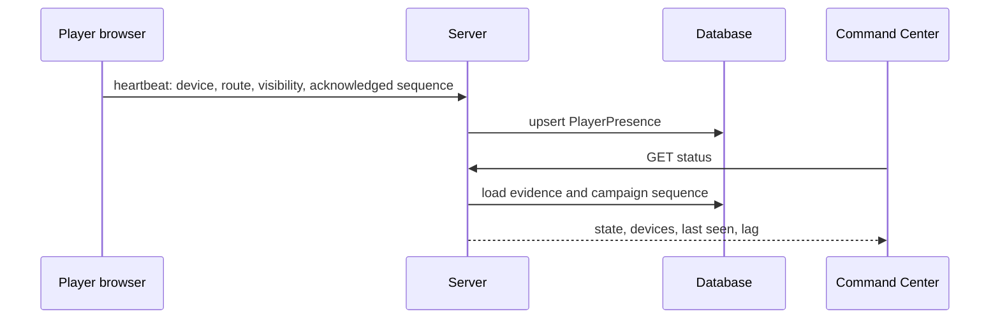

# Player presence and synchronization

## Phase 3 presentation synchronization

The Player controller records four distinct presentation cursors: observed, queued, presented, and acknowledged. Only the last cursor is eligible for the presence heartbeat, and it advances only after a valid authoritative presentation receipt and a successful idempotent viewed write. `PublicSnapshot.sequence` remains the business-state cursor and must not be posted as proof that a ceremony was presented.

Reconnect revalidates access before content, loads bounded Player-safe presentation history, loads the device's acknowledged event IDs in one batch, merges history with durable SSE replay by event sequence/ID, and queues only unseen authorized work. Replay stays behind authoritative work and does not affect any cursor used as delivery evidence. An access-revoked event is terminal for the current identity rather than a reconnect loop.

Connected means a non-disconnected heartbeat within 45 seconds. Recently lost means evidence within 120 seconds. Older evidence is stale; no evidence is unknown. A connected transport is never labeled “viewed.” Synchronized requires an active device whose acknowledged sequence equals the campaign sequence. Future production maintenance should expire records older than 30 days.
