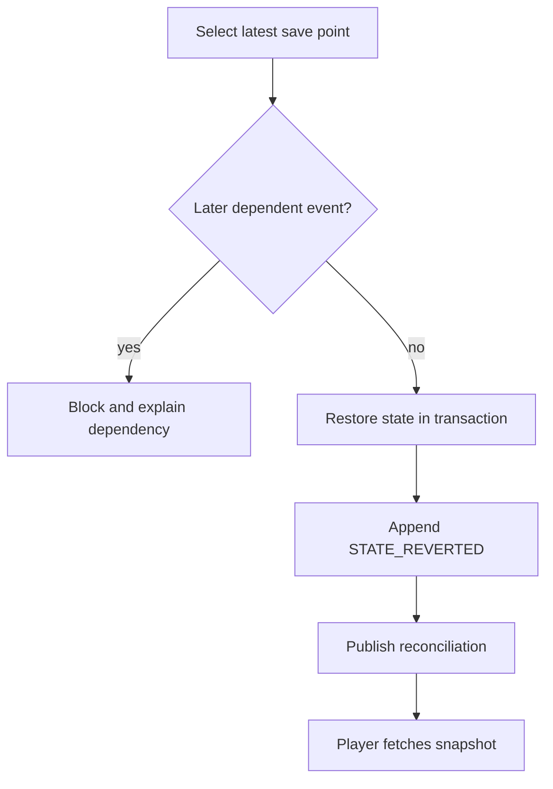

# Recovery and reversal

Phase 3 surfaces save points, labels only the latest as directly reversible, and preserves history through a compensating event. It never deletes the reversed event. Multi-event rollback and arbitrary restoration remain unavailable. Pause preserves released content; resume requires stale staged actions to be previewed again.
