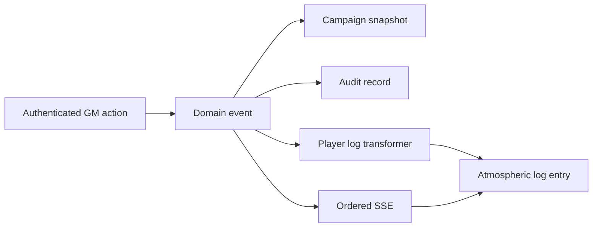

# Ship's Log

The Ship's Log is derived from ordered `ProgressEvent` records by `src/domain/ships-log.ts`. The transformation owns player-facing title, summary, symbol, importance, destination section, and safe target key. Unknown/internal events return no entry and never crash rendering.

Raw payloads, actor IDs, audit records, credentials, and internal notes are never log fields. The snapshot caps the initial log projection at 250 entries; later phases may add cursor pagination beyond that boundary.
