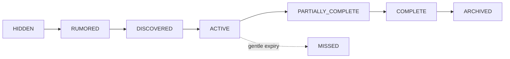

# Side-quest system

Optional mysteries use `HIDDEN`, `RUMORED`, `DISCOVERED`, `ACTIVE`, `PARTIALLY_COMPLETE`, `COMPLETE`, `MISSED`, and `ARCHIVED`. Hidden records are omitted. Rumored records expose only a safe teaser. Discovered and later records may expose title, premise, ordered objectives, safe reward, and released cross-links.

Side quests never block the main chapter state machine. Rewards are persisted, idempotent domain outcomes and may enrich—not gate—the future finale.
