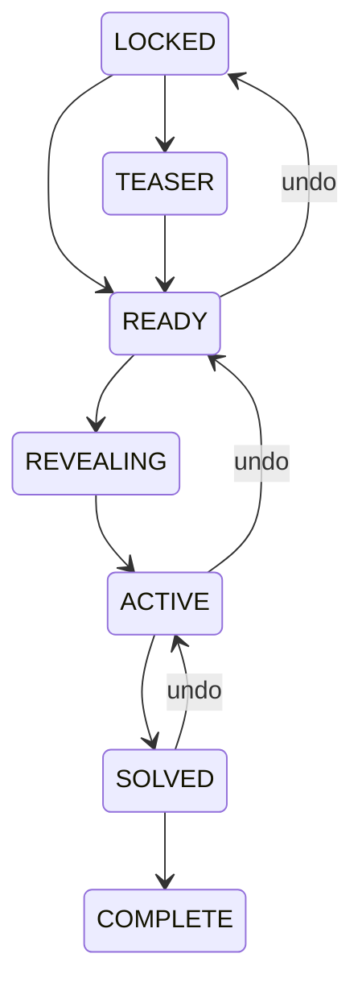

# Story state machine

## Companion sub-state

Chapter transitions remain authoritative. Map, route, artifact, side-quest, and finale state changes are separate domain events projected into the same campaign snapshot. They never bypass chapter visibility. New event types include route reveal, artifact silhouette/connection, quest completion, annotation/log arrival, and finale tease/requirement changes. Undo captures every mutable companion subsystem before applying a progression action.

The schema stores state and ordered immutable events rather than a chapter number alone. The vertical slice releases READY directly to durable ACTIVE in one transaction so animation failure never blocks truth; REVEALING is a client ceremony phase and remains available for future server acknowledgements. Every mutation saves a restore point, increments a campaign sequence, creates an event/snapshot/audit record, then publishes after commit. Event IDs plus device ceremony acknowledgements provide idempotency.
