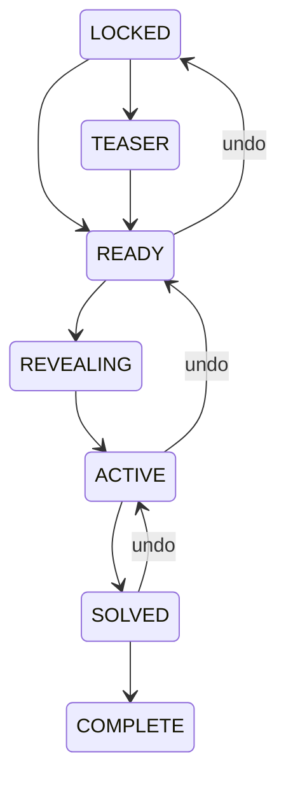

# Story state machine

The schema stores state and ordered immutable events rather than a chapter number alone. The vertical slice releases READY directly to durable ACTIVE in one transaction so animation failure never blocks truth; REVEALING is a client ceremony phase and remains available for future server acknowledgements. Every mutation saves a restore point, increments a campaign sequence, creates an event/snapshot/audit record, then publishes after commit. Event IDs plus device ceremony acknowledgements provide idempotency.

Administrative clients cannot set state directly. They submit named commands with an expected sequence. Pause blocks progression except resume, undo, and diagnostics. Ordered hints, unique awards, side-quest transitions, and chapter transitions are server-validated.
