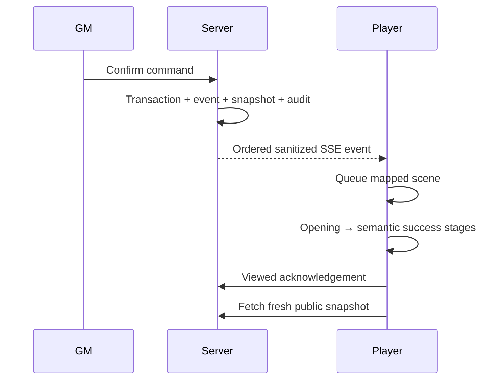

# Theatrical event system

## Phase 3 event contract

The exhaustive Player policy covers `CHAPTER_RELEASED`, `CHAPTER_SOLVED`, `ARTIFACT_AWARDED`, `ARTIFACT_SILHOUETTE_REVEALED`, `ARTIFACT_CONNECTED`, `MAP_LOCATION_REVEALED`, `MAP_ROUTE_REVEALED`, `SIDE_QUEST_DISCOVERED`, `SIDE_QUEST_UPDATED`, `SIDE_QUEST_COMPLETED`, `JOURNAL_ANNOTATION_ADDED`, `PLAYER_LOG_ENTRY_ADDED`, `FINALE_TEASED`, `FINALE_REQUIREMENT_UPDATED`, `CAMPAIGN_PAUSED`, `CAMPAIGN_RESUMED`, and `STATE_REVERTED`. Adding or removing a type leaves the exhaustive policy and its tests incomplete until a full declaration is supplied.

Delivery is modeled as separate committed, process-published, client-observed, queued, presented, and acknowledged states. The controller tracks observed, queued, presented, and acknowledged cursors independently and never treats the snapshot sequence as cinematic completion. The authoritative-first queue deduplicates stable event IDs, rejects stale work, and can interrupt replay before its semantic commit boundary.

Every event has a host-local readable heading/summary and explicit notification politeness. Optional relevant-section enhancement starts only after global commit and never owns ordering, replay, fallback, or acknowledgment. A viewed write occurs only for an authoritative receipt whose Director evidence permits acknowledgment; duplicate, stale, failed, cancelled, and replay work cannot acknowledge.

Meaningful chapter, map, artifact, quest, log, objective, and finale events share one ordered promise queue and one SSE connection. Each event maps to a registered scene, has a stable ID/final-state snapshot, supports reduced motion and skip, acknowledges only after presentation reaches a safe final state, and does not auto-replay after refresh once viewed. Explicit replay remains available from authorized Player-safe history.

If a tab hides, the active timeline pauses. If connectivity drops, database replay by sequence remains authoritative. If a visual runtime fails, the static fallback and snapshot still render. Replay creates only a local presentation. Procedural Web Audio cues begin only after user interaction, follow mute/volume preferences, and close on unmount.
