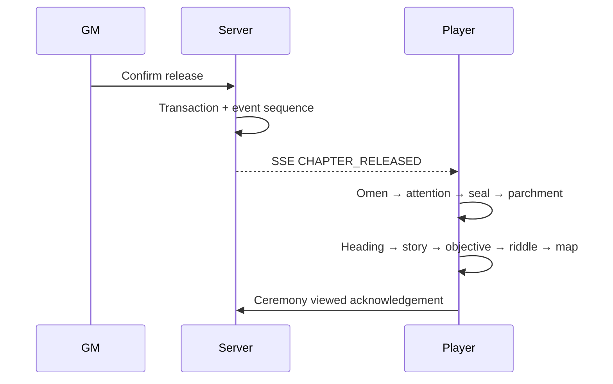

# Theatrical event system

## Phase 2 ceremonies

Meaningful map, artifact, quest, log, objective, and finale events reuse the ordered ceremony queue. Routine section navigation stays fast. Every event has a final-state snapshot, reduced-motion path, skip path, and stable event identity; refresh does not replay an acknowledged ceremony. See `docs/cinematic-system.md` for reusable motion primitives.

`useCeremony` owns one sorted queue and AbortController; components contain no independent timeout chains. Default timing totals about 6.3 seconds. Reduced motion uses attention, grouped ink stages, map, and active state with 120ms caps. Skip aborts presentation but still reconciles the authoritative snapshot. Replay creates a local synthetic event ID and never mutates progression. Audio is initialized only by “Open the journal”; the seal tone is procedural and low-volume.
