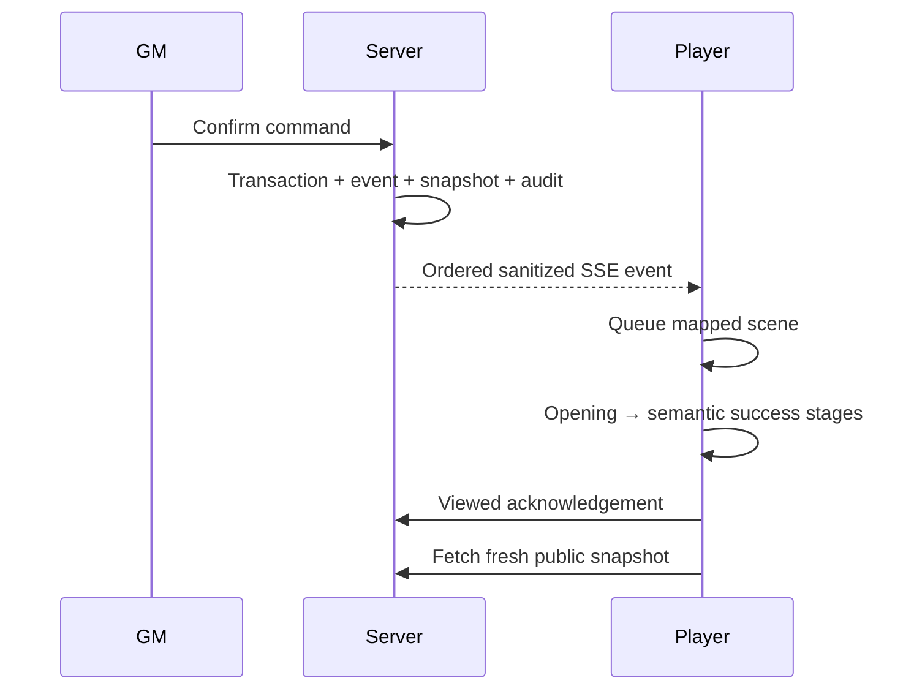

# Theatrical event system

Meaningful chapter, map, artifact, quest, log, objective, and finale events share one ordered promise queue and one SSE connection. Each event maps to a registered scene, has a stable ID/final-state snapshot, supports reduced motion and skip, acknowledges only after presentation reaches a safe final state, and does not replay after refresh once viewed.

If a tab hides, the active timeline pauses. If connectivity drops, database replay by sequence remains authoritative. If a visual runtime fails, the static fallback and snapshot still render. Replay creates only a local presentation. Procedural Web Audio cues begin only after user interaction, follow mute/volume preferences, and close on unmount.
