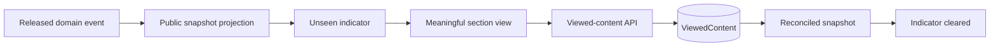

# Unseen content

`ViewedContent` stores `(playerAccessId, contentType, contentKey)` uniquely. This makes acknowledgements idempotent and persistent across refreshes and devices using the same player access identity. Ceremony playback remains device-specific in `ViewedCeremony` because replay expectations are local.

Content types are chapter, hint, annotation, map, route, artifact, quest, log, and finale. Indicators use text/screen-reader meaning in addition to visual marks.
