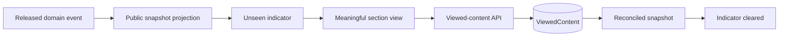

# Unseen content

## Ceremony acknowledgment and replay

`ViewedContent` describes semantic content reading. Phase 3 presentation uses the existing per-device `ViewedCeremony` identity for an event ceremony, so those two forms of unseen state do not collapse into one table or meaning. The Player can batch-read acknowledgments by device and a bounded set of event IDs; the server still verifies that the event type is eligible before accepting an idempotent viewed write.

Replay history is a bounded Player-safe projection, not a copy of stored event payloads. `CHAPTER_RELEASED` title, narrative, objective, and riddle are reconstructed only from the currently authorized public chapter. If that chapter is absent, locked, invalid, or unreadable, the event is omitted from presentation history. Replay uses a fresh presentation identity and never creates `ViewedContent`, `ViewedCeremony`, progression, presence, or audit mutation.

`ViewedContent` stores `(playerAccessId, contentType, contentKey)` uniquely. This makes acknowledgements idempotent and persistent across refreshes and devices using the same player access identity. Ceremony playback remains device-specific in `ViewedCeremony` because replay expectations are local.

Content types are chapter, hint, annotation, map, route, artifact, quest, log, and finale. Indicators use text/screen-reader meaning in addition to visual marks.
