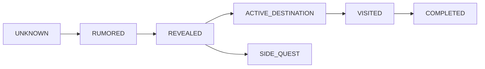

# Voyage Chart

The chart is a data-driven fictional narrative map. `MapLocation` stores internal labels, safe labels, reveal state, exactness, display coordinates, chapter/quest links, and completion. Coordinates and internal region details serialize only after an exact reveal. Rumored locations receive a safe label without coordinates.

`MapRoute` stores ordered endpoint keys and reveal state. A route is public only when it and both endpoints are revealed. The visual chart must also expose an equivalent keyboard-accessible location list.
